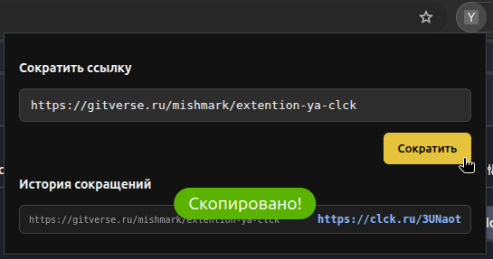

# Яндекс Кликер Сокращатель Ссылок

Простое и легковесное расширение для браузера, предназначенное для быстрого сокращения URL-адресов текущей вкладки с помощью сервиса **clck.ru** (Яндекс Кликер).

## ✨ Особенности

* **Автоматический захват URL:** При открытии расширения в поле ввода сразу подставляется адрес активной вкладки.
* **Modern CSS & Native Themes:** Интерфейс построен с использованием современной функции `light-dark()` и автоматически адаптируется под светлую или темную тему вашей операционной системы/браузера.
* **Безопасность (Manifest V3):** Расширение полностью соответствует актуальным требованиям безопасности Mozilla, не использует инлайн-скрипты (`inline scripts`) и имеет строго ограниченные разрешения.
* **CORS Bypass:** Настроенные `host_permissions` позволяют делать запросы напрямую к API Яндекса в обход ограничений Cross-Origin.

## 🛠 Структура проекта

Папка проекта должна содержать следующие файлы:
* `manifest.json` — конфигурационный файл расширения (Manifest V3).
* `popup.html` — верстка интерфейса и стили с авто-темой.
* `popup.js` — логика работы с API.

## 💻 Стек технологий

* **JavaScript (ES6+)**: Fetch API, Async/Await, WebExtensions API (`browser.tabs`).
* **Modern CSS**: Свойство `color-scheme`, CSS-переменные, функция `light-dark()`.